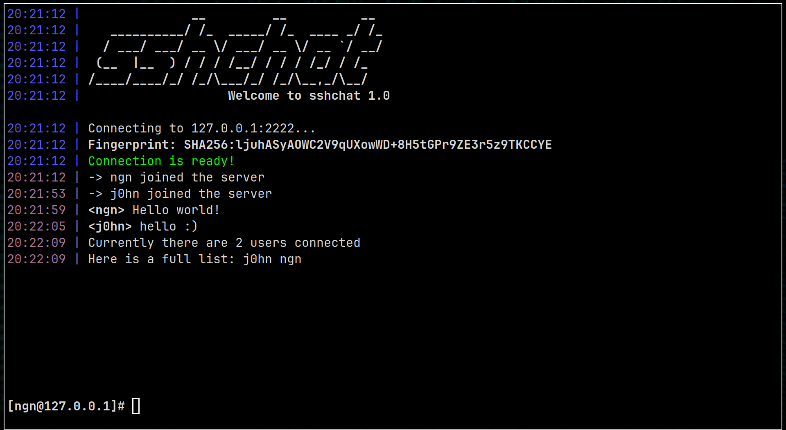

<h1 align="center">
  
  </br>
  </br>
  sshchat | chat over SSH
</h1>

Dead simple secure chat system over SSH, implemented with libssh

### How does it work?
Users connect to a [custom SSH server](server/) using a [custom SSH client](client/).
Server and the client then creates a communication channel, which the client uses to send
commands to the server, and the server sends the messages that the client should display.

The "protocol" is explained with more details in the [protocol documentation](docs/protocol.md).

### Features
- **Performance**: Server and the client uses a multi-threaded architecture - allo
- **Configuration**: You can configure every aspect of your server - SSH keys, MOTD, password protection etc.
- **Administration**: You can authenticate as an admin to kick, nick ban and IP ban other users.

### Installation
#### Client
- **Install the dependencies**: You will need a compiler (idealy gcc), make, libssh, ncurses and headers (libssh-dev, ncurses-dev)
- **Download the source code**: Visit the [releases tab](https://github.com/ngn13/sshchat/tags) and download the latest archive
- **Extract and compile**: Extract the archive, change directory into the [`client`](client/) directory and run `make`
- **Install the binary**: Install the binary by running `make install` as root (or use sudo)

After the installation, you can run the client with the `sshchat` command.

You can display the avaliable commands by running `.help` after connecting to a server.

#### Server
- **Install the dependencies**: You will need a compiler (idealy gcc), make, openssh, libssh, libinih and headers (libssh-dev, libinih-dev)
- **Download the source code**: Visit the [releases tab](https://github.com/ngn13/sshchat/tags) and download the latest archive
- **Extract and compile**: Extract the archive, change directory into the [`server`](server/) directory and run `make`
- **Generate your keys**: Generate a pair of SSH keys for the server by running `make keygen`
- **Install the binary**: Install the binary and the default configuration by running `make install` as root (or use sudo)

After the installation, you can run the server with the `sshchat-server` command.

The [default server configuration](server/install/config.ini) which is located at `/etc/sshchat/config.ini`, has comments exaplaining
every option.

### Contributing
If you want to contribute, feel free to do so! For example, you can start by [adding a new command](/server/src/cmd.c).
When you are done, please make sure to format the code with `clang-format`:
```bash
make format
```
